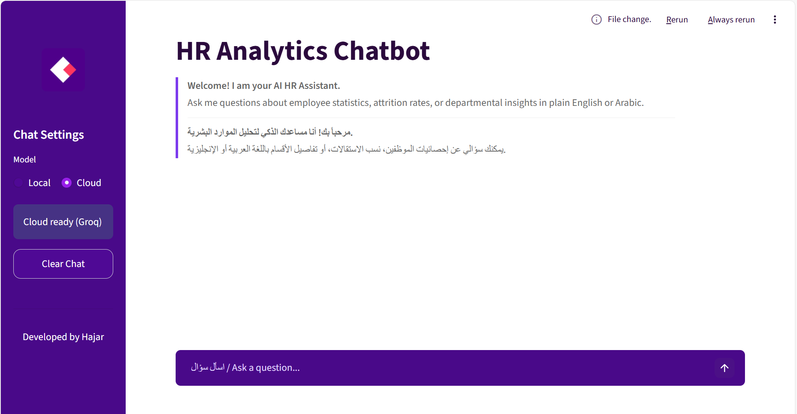
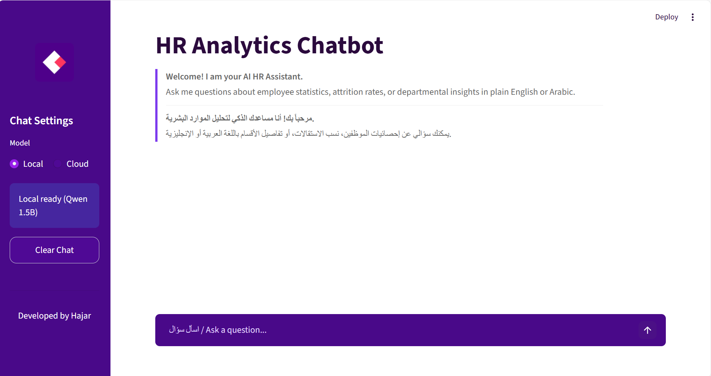
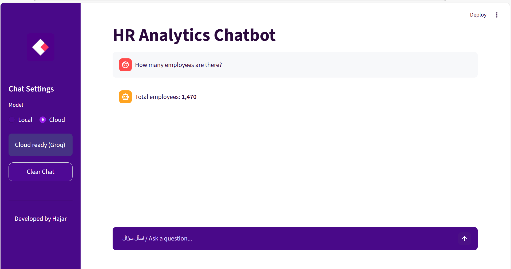
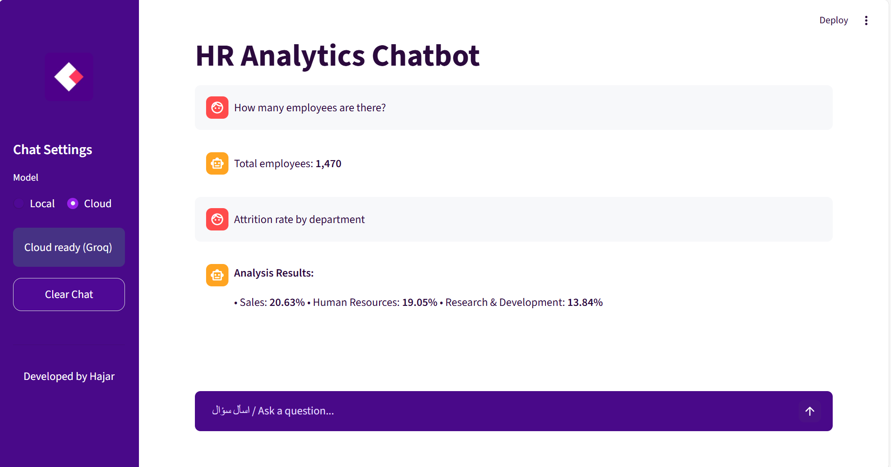
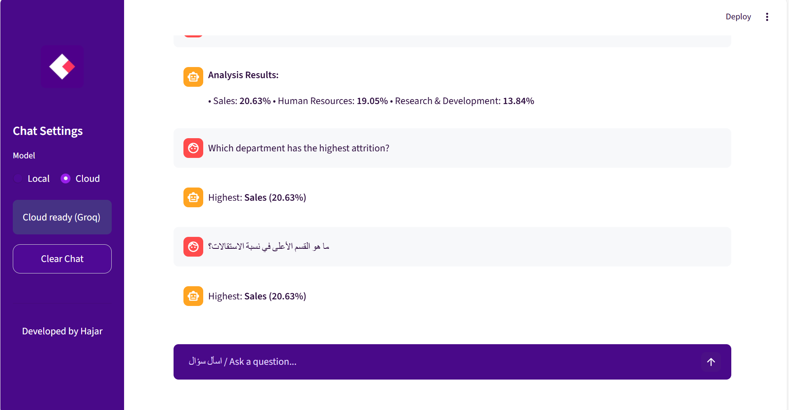
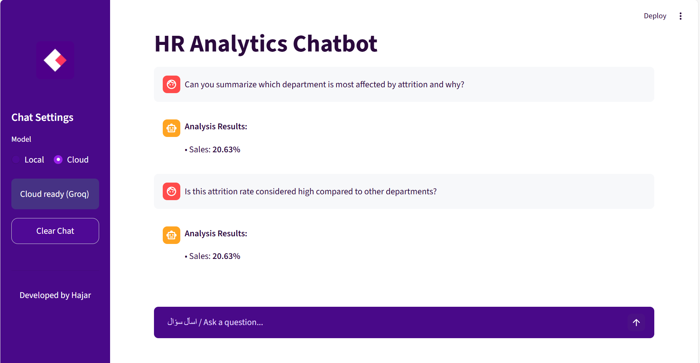
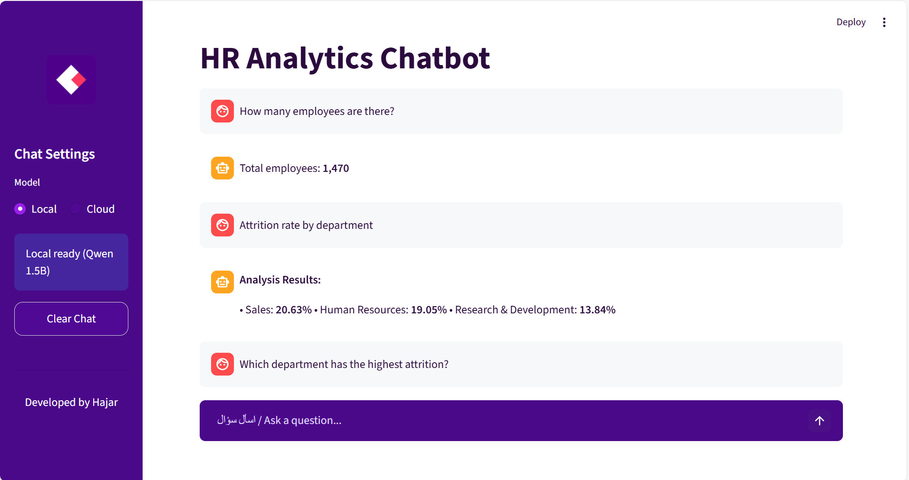
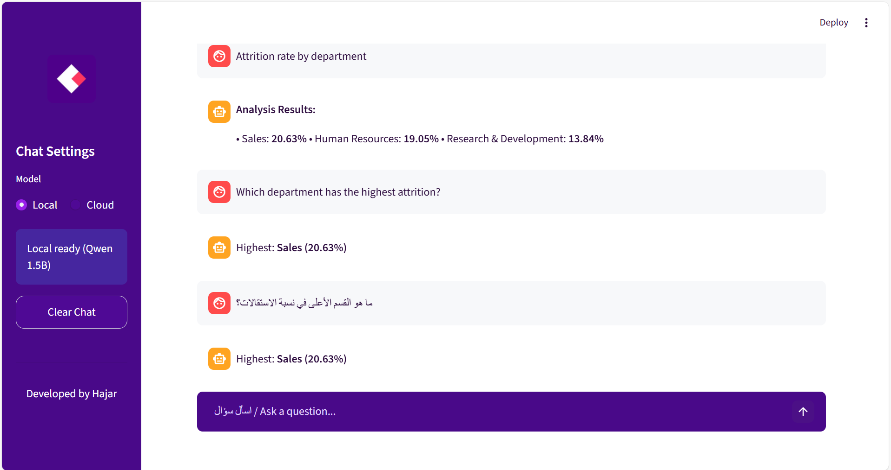

```
# HR Analytics Chatbot 

An intelligent HR Analytics Chatbot that allows users to explore and analyze HR data through natural language questions.  
The chatbot supports both **cloud-based** and **local** Large Language Models (LLMs) and connects directly to structured HR data using a **Text-to-SQL** approach.

---

## 🎯 Project Objective

The goal of this project is to transform traditional, static HR data analysis into an **interactive conversational experience**.  
Users can ask questions in **plain English or Arabic**, and the chatbot will generate accurate answers by querying the underlying HR dataset.

This project demonstrates:
- Integration of LLMs with structured data
- Practical use of Text-to-SQL
- Comparison between Cloud-based and Local AI models
- Professional AI application development standards

---

## 📂 Dataset

- **Dataset Name:** IBM HR Analytics Employee Attrition & Performance  
- **File:** `WA_Fn-UseC_-HR-Employee-Attrition.csv`
- **Description:**  
  Contains employee demographic information, job roles, departments, attrition status, and performance-related attributes.

The dataset is stored locally and queried dynamically via SQLite.

---

## 🛠️ Environment & Tools

- **Environment Management:** Conda
- **Programming Language:** Python
- **Framework:** Streamlit
- **Data Processing:** Pandas
- **Database:** SQLite
- **AI Models:**
  - **Cloud Model:** Groq API (High-speed inference)
  - **Local Model:** Qwen 1.5B (Running locally on CPU)
- **Model Integration:** Text-to-SQL (No RAG in final flow)

---

## 🧠 System Architecture

1. User submits a question through the chat interface.
2. The selected LLM (Cloud or Local) converts the question into a SQL query.
3. The query is executed on the SQLite database.
4. Results are returned and formatted as a conversational response.
5. Chat history is preserved within the session to support follow-up questions.

---

## 🔁 Dual Model Support

### ☁️ Cloud-Based Model (Groq)
- Faster response time
- Ideal for complex or multi-step questions
- Requires API configuration

### 💻 Local Model (Qwen 1.5B)
- Runs fully offline
- More privacy-friendly
- Slightly slower but reliable for core analytics

Users can switch between models directly from the sidebar.

---

## 💬 Supported Question Types

- Employee counts and summaries
- Attrition rates by department
- Comparison between departments
- Follow-up analytical questions
- Arabic and English queries

Example questions:
- *How many employees are there?*
- *Attrition rate by department*
- *Which department has the highest attrition?*
- *ما هو القسم الأعلى في نسبة الاستقالات؟

---

## 🗂️ Project Structure

```

HR_Analytics_Chatbot/
├─ app.py                 
├─ requirements.txt       
├─ README.md              
├─ styles.css              
├─ logo.png                
│
├─ data/
│   └─ WA_Fn-UseC_-HR-Employee-Attrition.csv
│
├─ screenshots/            
│
└─ src/
├─ llm/
│  ├─ cloud_groq.py     
│  ├─ local_qwen.py    
│  ├─ sql_agent.py      # Text-to-SQL logic
│  └─ prompt.py         
│
├─ data_loader.py       # Data loading utilities
└─ config.py            # Configuration settings

````

---

## ⚙️ Installation & Setup

### 1️⃣ Clone the repository
```bash
git clone <repository-url>
cd HR_Analytics_Chatbot
````

### 2️⃣ Create Conda environment

```bash
conda create -n hr_chatbot python=3.10
conda activate hr_chatbot
```

### 3️⃣ Install dependencies

```bash
pip install -r requirements.txt
```

### 4️⃣ Run the application

```bash
streamlit run app.py
```

---

## 📌 Professional Practices Followed

* Small, meaningful Git commits
* Clean project structure
* Clear separation between Cloud and Local models
* README documentation with screenshots
* Reproducible environment via `requirements.txt`

---

##  Cloud vs Local Model Comparison

| Aspect            | Cloud (Groq) | Local (Qwen 1.5B) |
| ----------------- | ------------ | ----------------- |
| Speed             | Very Fast    | Moderate          |
| Internet Required | Yes          | No                |
| Privacy           | Lower        | Higher            |
| Resource Usage    | Low          | Higher (CPU)      |

---

## 🖼️ Application Screenshots

### Home Screen – Cloud Mode


### Home Screen – Local Mode


### Total Employees Query


### Core Q&A Flow – Cloud Model


### Cloud Model – Analysis Results


### Cloud Model – Advanced Analysis


### Local Model – Analysis Results



---
